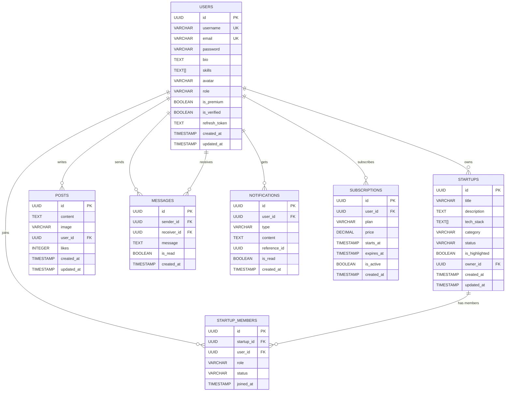

# BirgaQil — ER Diagram

```mermaid
erDiagram
    USERS {
        UUID id PK
        VARCHAR username UK
        VARCHAR email UK
        VARCHAR password
        TEXT bio
        TEXT[] skills
        VARCHAR avatar
        VARCHAR role
        BOOLEAN is_premium
        BOOLEAN is_verified
        TEXT refresh_token
        TIMESTAMP created_at
        TIMESTAMP updated_at
    }

    STARTUPS {
        UUID id PK
        VARCHAR title
        TEXT description
        TEXT[] tech_stack
        VARCHAR category
        VARCHAR status
        BOOLEAN is_highlighted
        UUID owner_id FK
        TIMESTAMP created_at
        TIMESTAMP updated_at
    }

    STARTUP_MEMBERS {
        UUID id PK
        UUID startup_id FK
        UUID user_id FK
        VARCHAR role
        VARCHAR status
        TIMESTAMP joined_at
    }

    POSTS {
        UUID id PK
        TEXT content
        VARCHAR image
        UUID user_id FK
        INTEGER likes
        TIMESTAMP created_at
        TIMESTAMP updated_at
    }

    MESSAGES {
        UUID id PK
        UUID sender_id FK
        UUID receiver_id FK
        TEXT message
        BOOLEAN is_read
        TIMESTAMP created_at
    }

    NOTIFICATIONS {
        UUID id PK
        UUID user_id FK
        VARCHAR type
        TEXT content
        UUID reference_id
        BOOLEAN is_read
        TIMESTAMP created_at
    }

    SUBSCRIPTIONS {
        UUID id PK
        UUID user_id FK
        VARCHAR plan
        DECIMAL price
        TIMESTAMP starts_at
        TIMESTAMP expires_at
        BOOLEAN is_active
        TIMESTAMP created_at
    }

    USERS ||--o{ STARTUPS : "owns"
    USERS ||--o{ STARTUP_MEMBERS : "joins"
    STARTUPS ||--o{ STARTUP_MEMBERS : "has members"
    USERS ||--o{ POSTS : "writes"
    USERS ||--o{ MESSAGES : "sends"
    USERS ||--o{ MESSAGES : "receives"
    USERS ||--o{ NOTIFICATIONS : "gets"
    USERS ||--o{ SUBSCRIPTIONS : "subscribes"
```
